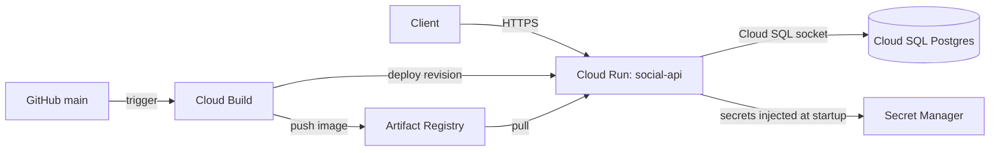

# Social Media API


A FastAPI backend with JWT authentication and posts with image uploads. The app is intentionally
simple. I built it as a vehicle for practicing a real deployment on GCP (Cloud Run, Cloud SQL,
Secret Manager, Artifact Registry, Cloud Build), and the interesting part is how it is run and what
I changed between versions. See [Design decisions](#design-decisions-v1--v2).

## Quick start (local)

```bash
docker-compose up --build
```

API on `http://localhost:8000`. FastAPI's interactive docs are at `/docs`.

## Running the tests

```bash
pip install -r requirements.txt -r requirements-dev.txt
pytest
```

Tests use an in-memory SQLite database. CI (GitHub Actions) runs lint, tests and a Docker build on
every pull request.

## Endpoints

### Auth
- `POST /auth/register` - Create account
- `POST /auth/login` - Get JWT token

### Users
- `GET /users/me` - Get current user (protected)
- `PUT /users/me` - Update current user (protected)
- `GET /users/{user_id}` - Get user by ID

### Posts
- `POST /posts` - Create post with optional image (protected)
- `GET /posts` - List posts (query params: `skip`, `limit`, `user_id`)
- `GET /posts/{post_id}` - Get post by ID
- `PUT /posts/{post_id}` - Update post (protected, owner only)
- `DELETE /posts/{post_id}` - Delete post (protected, owner only)
- `GET /posts/users/{user_id}/posts` - Get user's posts

## Usage example

```bash
# Register
curl -X POST http://localhost:8000/auth/register \
  -H "Content-Type: application/json" \
  -d '{"username":"john","email":"john@example.com","password":"pass123"}'

# Login
curl -X POST http://localhost:8000/auth/login \
  -H "Content-Type: application/json" \
  -d '{"username":"john","password":"pass123"}'

# Create post (use token from login)
curl -X POST http://localhost:8000/posts \
  -H "Authorization: Bearer YOUR_TOKEN" \
  -F "title=My Post" \
  -F "content=Hello world" \
  -F "image=@image.jpg"

# Get posts
curl "http://localhost:8000/posts?skip=0&limit=10"
```

## Architecture (GCP)



Deployment steps, IAM setup, cost notes and teardown are in [DEPLOYMENT.md](DEPLOYMENT.md).

## Design decisions (v1 → v2)

| Area | v1 | v2 | Why | What it costs |
|---|---|---|---|---|
| Image registry | `gcr.io` (legacy Container Registry path) | Artifact Registry | Current standard on GCP; regional repos with per-repo IAM | One more API to enable; old images need a cleanup policy |
| Secrets | `SECRET_KEY` and `DATABASE_URL` as plain env vars in the deploy command | Secret Manager via `--set-secrets` | Values stay out of shell history, command logs and revision config | More IAM to set up; startup now depends on Secret Manager |
| JWT signing key | Regenerated on every manual deploy (`openssl rand` inside the deploy command), invalidating all tokens | One stable key in Secret Manager | Deploys stop logging everyone out | Rotating the key still invalidates tokens, by design |
| Secret versions | n/a | Mapped to `:latest` | Rotation doesn't require editing deploy config | Less reproducible than pinning a version |
| Image tags | `latest` | Git commit SHA | Every deploy is traceable and rollbacks are exact | Needs a trigger (`$SHORT_SHA` is only set for triggered builds) |
| Deploy config | Pipeline only updated the image and relied on a manual first deploy to set the DB, env vars and secrets | Full runtime config declared in `cloudbuild.yaml` | Reproducible from an empty project | Config lives in a CI file; v3 moves it to Terraform |
| Build permissions | Default build identity | Dedicated service accounts for build and runtime | Least privilege | `roles/run.admin` is still broader than ideal (needed for `--allow-unauthenticated`) |
| Testing | `test_api.sh` (curl script) | pytest with in-memory SQLite, plus CI | Regressions are caught before merge | SQLite is not PostgreSQL, so some behavior differences can slip through |
| Compute | Cloud Run | Cloud Run (unchanged) | Scale to zero, no cluster to run | Cold starts, ephemeral disk, `--max-instances=1` caps throughput |

## Known limitations

- **Superuser database access.** The app connects as the `postgres` user. A dedicated
  least-privilege user is planned.
- **Public IP on Cloud SQL.** Access goes through the Cloud SQL connection, but the instance still has a
  public IP. Private IP with VPC connectivity is planned.
- **CI and CD are separate.** GitHub Actions runs the tests and Cloud Build deploys on push to `main`.
  Without a branch protection rule requiring the CI check, a failing commit could still be deployed.
- **No backup and restore strategy** is documented or tested.
- **Single region, single instance** (`--max-instances=1`). This keeps the demo cheap and bounds
  database connections, at the cost of throughput and availability.
- **Cost:** Cloud SQL bills while it exists. See the cost notes in [DEPLOYMENT.md](DEPLOYMENT.md).


## v3 roadmap

- Terraform for the whole stack (Cloud Run, Cloud SQL, Secret Manager, IAM, Artifact Registry)
- Deploy the same container to GKE (Helm + Argo CD) and compare with Cloud Run
- Workload Identity Federation for GitHub Actions (no long-lived credentials)
- Prometheus metrics and SLO-based alerts
- Cloud Storage for uploaded images
- Dedicated least-privilege database user; store only the password in Secret Manager

## Project structure

```
app/
├── auth/           # JWT auth logic
├── users/          # User CRUD
├── posts/          # Post CRUD + image handling
├── config.py       # Settings
├── database.py     # DB connection
├── models.py       # SQLAlchemy models
└── main.py         # FastAPI app
tests/              # pytest suite
.github/workflows/  # CI
cloudbuild.yaml     # Build, push, deploy
DEPLOYMENT.md       # GCP runbook
```
## What broke and why

**Tests: every test errored with `unexpected keyword argument 'app'`.**
The Starlette version pinned in `requirements.txt` has a TestClient that breaks on
`httpx` 0.28 and newer. Fix: pin `httpx<0.28` in `requirements-dev.txt`. The proper
fix is upgrading FastAPI and Starlette, which is on the v3 list.

**First Cloud Build failed with `COPY .env: file not found`.**
The v1 Dockerfile copied a local `.env` into the image. That worked when I built
from my laptop, because `gcloud builds submit` uploads the local folder. A trigger
builds from a clean GitHub clone, where `.env` is correctly absent. It was also a
design flaw: it baked local config into every image layer, which defeats the point of
Secret Manager. Fix: removed the line and added a `.dockerignore`. Runtime config now
arrives as environment variables from Secret Manager.

**`POST /posts` returned 403 in Swagger even after logging in.**
Not an API bug. The Swagger request had no token. On the pinned FastAPI version,
missing credentials return 403 instead of 401. Fix: click Authorize and paste only
the `access_token` value. Newer FastAPI versions return 401, so this is another
reason to upgrade in v3.

**ruff
CI lint failed on import ordering and an over-strict rule that conflicts with FastAPI's Depends idiom. I pinned an explicit ruff rule set.